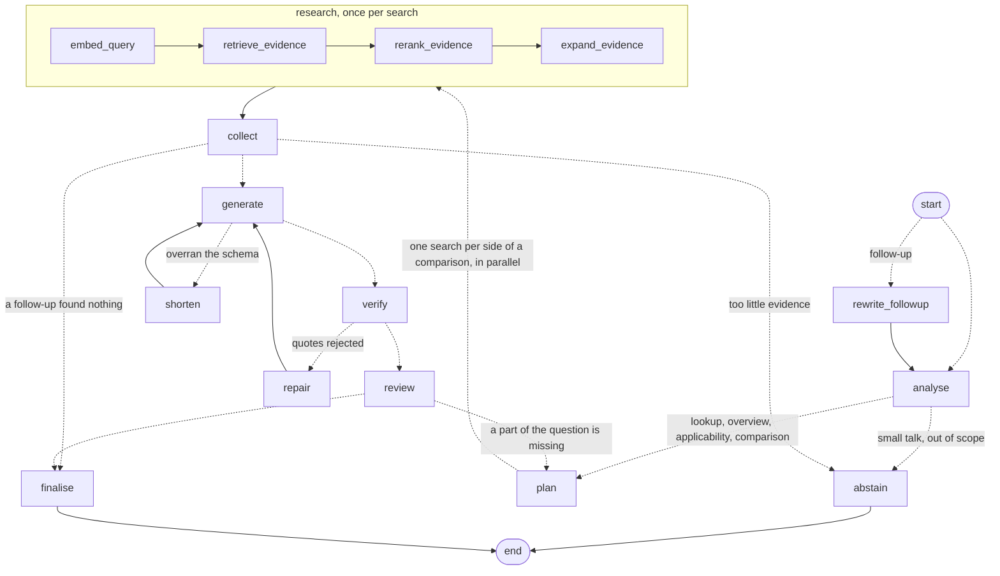

# Trustworthy EU AI Act Assistant

A RAG assistant that answers questions about the EU AI Act using official EUR-Lex sources,
where every claim in an answer is backed by a citation that's **mechanically verified**
against the source text — not just asked for in a prompt.

The goal isn't the chatbot itself. It's demonstrating that an LLM system can be made reliable
in a regulated domain: answers are grounded in authoritative text, the system abstains when
evidence is thin, every answer records which version of the law produced it, and the corpus
can be safely re-ingested when the regulation changes.

## The source

At the centre of the corpus is one legal document, Regulation (EU) 2024/1689 — the EU AI Act
— published on EUR-Lex under CELEX `32024R1689`:

<https://eur-lex.europa.eu/legal-content/EN/ALL/?uri=CELEX:32024R1689>

It is the authoritative text, and it covers:

- definitions of AI systems
- risk classifications
- prohibited AI practices
- high-risk AI requirements
- transparency requirements
- general-purpose AI requirements
- provider and deployer obligations
- governance
- enforcement
- penalties

Those are the subjects the assistant can be asked about. Anything outside them — GDPR,
national law, an article number that doesn't exist — is not in the corpus, and the system
abstains rather than answering from the model's own memory.

### Commission material, and why it is not treated as law

The Commission also publishes guidelines, codes of practice and Q&A that interpret the Act,
from its [AI Act page](https://digital-strategy.ec.europa.eu/en/policies/regulatory-framework-ai).
Eleven of those are indexed alongside the Regulation — listed in
`src/euaia/ingest/ec_documents.py`, downloaded into `data/raw/AI_Act/` by
`uv run python -m euaia.ingest.ec_documents`, and ingested with the rest of the corpus.

They are **not** equal to the Act, and the system does not treat them as such. Every source
declares an authority tier:

| Tier | What it is | What it can support |
|---|---|---|
| `law` | Regulation (EU) 2024/1689 | What is legally required |
| `guidance` | Commission guidelines and Q&A | How the Commission interprets the Act |
| `code` | Codes of practice | A voluntary way of demonstrating compliance |

The distinction is load-bearing rather than decorative. Asked "what must I do?", a voluntary
code of practice frequently out-ranks the provision it implements — it is longer, more
concrete, and repeats the question's vocabulary — so similarity search alone would answer a
question about legal obligations mostly out of a document that imposes none.

So relevance decides which provisions survive retrieval, and authority decides what happens
next: binding text is read first, each evidence block tells the answering model what kind of
document it came from, and the model is instructed never to state a requirement on the
strength of guidance or a code. An answer drawing on more than one tier is rendered under
headings that say so:

> **Legal requirement** — Article 50(2) requires providers to mark AI-generated content…
>
> **Commission guidance** — the transparency guidelines explain that this applies to…
>
> **Practical implementation** — the code of practice suggests…

Each claim's tier is **computed from the quotes that survived verification**, not stated by
the model — for the same reason the quotes themselves are checked rather than trusted.

Three of the high-risk classification guidelines are **drafts** (published 19 May 2026 for
consultation, final expected end of 2026). They are indexed, and their version label reads
`draft 2026-05-19`, which reaches the evidence block so the answer can say so.

Four further differences from the Act are measured and explained in `ec_documents.py`'s
module docstring — no bookmark outline on one document, no article structure, no
per-provision deep links, and no CELLAR version tracking. Read it before extending ingestion.

## How it works

1. **Ingest** — the EU AI Act is pulled from EUR-Lex (CELLAR API) as PDF and parsed into its
   actual legal structure (articles, paragraphs, annexes, recitals), chunked, and embedded.
   The consolidated text is read from the bookmark outline EUR-Lex authors inside the file,
   rather than by guessing headings from fonts. The recitals come from the as-adopted act,
   whose PDF has no such outline — they are recovered from the preamble instead, and the
   parse is only accepted if the recital numbering forms a complete 1..N run.
2. **Retrieve** — a hybrid search (vector similarity + full-text + direct article lookup)
   finds candidate provisions, which are reranked for relevance.
3. **Generate** — the answering model is required to return each claim together with the
   exact quotes it's based on, via structured output.
4. **Verify** — every quote is checked to appear **verbatim** in the source provision it
   claims to come from. Quotes that don't match are dropped; claims with no surviving quote
   are never shown. If too few claims survive, the system abstains instead of guessing.

For "is my system high-risk?"-type questions, the assistant never states a verdict — it
returns a checklist of the relevant criteria, cited and quoted, with the questions needed to
resolve it. The determination depends on facts only the user has.

In the chat, an answer reads as prose with a small citation link after each statement; hovering
shows the verified quote, clicking opens the provision on EUR-Lex. A follow-up such as "what
about providers?" is first rewritten into a standalone question, so retrieval and verification
still work on one self-contained question. Conversations are saved per user.

The answer pipeline is a LangGraph `StateGraph`. Each kind of question takes its own path:
a comparison searches each side in parallel, an applicability question adds the provisions
of its legal test, an overview adds the outline of the whole group. After the answer is
verified, a review can send one follow-up round for a missing part, and a final step brings
the rounds together. Every decision is an edge (dotted below); the paths are explained in
[`src/euaia/graph/README.md`](src/euaia/graph/README.md).



## Stack

| Layer | Choice |
|---|---|
| Sources | EUR-Lex CELLAR (the Act) + European Commission guidelines, codes of practice and Q&A, ranked by authority |
| Store | Postgres 17 + pgvector |
| Embeddings | Gemini `gemini-embedding-001` |
| Generation | Groq `openai/gpt-oss-120b`, structured output |
| Query analysis | Groq `openai/gpt-oss-20b` |
| Reranking | NVIDIA `llama-nemotron-rerank-vl-1b-v2` via OpenRouter, or `BAAI/bge-reranker-v2-m3` run locally (set in `config.py`) |
| Orchestration | LangGraph |
| Chat | Chainlit, with sign-in and saved conversations |
| Admin / API | FastAPI + Jinja2 + HTMX, with a Monitor page (Chart.js) |
| Monitoring | Langfuse, self-hosted in Docker: a trace per question, tokens per call, quality scores |

Both providers are used on free tiers, which are tight enough to shape the design directly —
chunking, caching, and prompt sizing are all built to fit inside them. Details on that, and on
why quote-matching is exact rather than fuzzy, are in the code's module docstrings
(`src/euaia/verify/citations.py`, `src/euaia/ingest/embeddings.py`).

Reranking uses a cross-encoder, not an LLM. An LLM reranker scores every candidate inside a
single prompt, so its cost is the sum of all candidates — 20 chunks is ~9,000 tokens against a
free-tier ceiling of 8,000 per minute, which made a full candidate set impossible to score and
forced the rate limiter to idle ~58s before each call. A cross-encoder scores each
`(question, passage)` pair independently: no shared budget, no per-minute ceiling, no tokens.
It runs hosted on OpenRouter by default, or locally; see [Reranker model](#reranker-model).

## Setup

Requires Python 3.12+, [uv](https://docs.astral.sh/uv/), and Docker. Every command below is
the same on macOS, Linux and Windows — except copying the env file, where Windows needs
`copy` (PowerShell: `Copy-Item`) in place of `cp`.

```bash
cp .env.example .env      # then fill in GROQ_API_KEY, GOOGLE_API_KEY and OPENROUTER_API_KEY
uv sync --extra dev
docker compose up -d db
uv run alembic upgrade head
```

Then build the corpus, **in this order**. No source documents are stored in the repository;
step 1 fetches them and skips anything already on disk, so re-running is free.

```bash
# 1. Download everything: the AI Act from EUR-Lex, and the Commission's guidelines,
#    codes of practice and Q&A into data/raw/AI_Act/. No database or API key needed.
uv run python -m euaia.ingest.ec_documents

# 2. Parse, chunk, embed and activate all thirteen sources in one pass.
uv run python -m euaia.ingest.pipeline
```

That registers thirteen sources. Two are the Act itself — `eu-ai-act`, the latest consolidated
act (operative text with amendments applied), and `eu-ai-act-recitals`, the act as adopted
(for its recitals, which consolidation doesn't restate). The other eleven are the Commission's
material, described under [Commission material](#commission-material-and-why-it-is-not-treated-as-law).

Steps 1 and 3 call the embedding API. A fresh machine needs about 780 embeddings against
Gemini's free limit of 1,000 per day, so add `--resume 5` to wait out the limit rather than
fail, or `--skip-embeddings` to parse and store the structure with no API key at all. Once
embedded, the content-hash cache means re-ingesting unchanged text costs nothing.

Set `CHAT_USERS` and `CHAINLIT_AUTH_SECRET` in `.env` (see `.env.example`), then start the
chat and open <http://127.0.0.1:8001>:

```bash
uv run python -m euaia.chat
```

The admin dashboard (corpus status and change detection, behind `ADMIN_PASSWORD`) is a
separate app on <http://127.0.0.1:8000/status>:

```bash
uv run uvicorn euaia.api.main:app --reload
```

## Running with Docker

The whole stack — database, migrations, chat, admin dashboard — runs under Docker Compose,
with no local Python needed.

```bash
cp .env.example .env      # fill in GROQ_API_KEY, GOOGLE_API_KEY, OPENROUTER_API_KEY,
                          # POSTGRES_PASSWORD, ADMIN_PASSWORD, CHAT_USERS, CHAINLIT_AUTH_SECRET
docker compose up -d --build
```

Then open the chat at <http://127.0.0.1:8001>, or the admin dashboard at
<http://127.0.0.1:8000/status>. The image is built for the hosted reranker, the default, so
it contains no torch and no model weights. To use the local reranker instead, see
[Reranker model](#reranker-model): the image must then be built with `LOCAL_RERANK=true`, and
the chat downloads the weights (~2.3 GB) on first start before it begins serving; follow it
with `docker compose logs -f chat`. Later starts reuse them from a volume.

Build the corpus once, **in this order** (and repeat whenever you want to pick up a new
consolidated version). Nothing is stored in the repository; each step fetches what it needs
and skips whatever is already in the `euaia-raw` volume.

```bash
docker compose --profile tools run --rm fetch-docs    # 1. download everything
docker compose --profile tools run --rm ingest        # 2. index it
```

Step 1 downloads the Act from EUR-Lex and the Commission's documents, and needs no database
or API key. Step 2 finds all of them on disk and indexes the thirteen sources in one pass.

Add `--skip-embeddings` to either `ingest` call to parse and store structure with no API key,
or `--resume 5` to wait out the embedding quota instead of failing:

```bash
docker compose --profile tools run --rm ingest --skip-embeddings
```

| Service | Role | Lifetime |
|---|---|---|
| `db` | Postgres 17 + pgvector, published on `127.0.0.1:5433` | long-running |
| `migrate` | `alembic upgrade head` | runs once per `up`, then exits |
| `chat` | Chainlit chat on `127.0.0.1:8001` | long-running, waits for `migrate` |
| `app` | admin dashboard, `/api/ask` and `/healthz` on `127.0.0.1:8000` | long-running, waits for `migrate` |
| `ingest` | fetch, parse, chunk, embed | on demand, `tools` profile only |

Data lives in three named volumes: `euaia-pgdata` (database), `euaia-models` (reranker
weights), `euaia-raw` (downloaded PDFs). `docker compose down` keeps them;
`docker compose down -v` deletes all three, including the embedded corpus.

Notes:

- **`DATABASE_URL` in `.env` is ignored inside containers.** It points at `127.0.0.1:5433`,
  the host side of the port mapping, which a container cannot reach. Compose builds the
  in-network URL (`db:5432`) from `POSTGRES_PASSWORD` instead, so that value must be URL-safe.
  Keep `DATABASE_URL` for running tools on the host.
- **`.env` never enters the image** — it is excluded by `.dockerignore` and supplied at run
  time.
- **PyTorch is only in the image with `LOCAL_RERANK=true`, and then CPU-only.** On Linux,
  PyPI's torch pulls the full CUDA stack; `pyproject.toml` routes it to the CPU wheel index
  instead, keeping several GB of unused GPU libraries out of the image.
- Everything is published on `127.0.0.1` only. Nothing is reachable from other machines.

## Monitoring

Two views of how the assistant is doing, both local:

- **The admin dashboard's Monitor page** (<http://127.0.0.1:8000/monitor>) shows the
  numbers over time. It covers:
  - answer rate and quote accuracy
  - coverage and tokens per question
  - latency, split from time spent waiting for rate limits
  - how often the review asks for a second round
  - mean time per graph step
  - today's free-tier quotas
  - accuracy from each evaluation run
  - the last 25 questions with the path each took through the graph

  It reads the `query_log` row every question writes, so it works with tracing off. It
  refreshes every 15 seconds.
- **Langfuse** (<http://127.0.0.1:3000>) takes one question apart. Each question is a trace,
  recorded through Langfuse's official LangGraph integration (its LangChain
  `CallbackHandler`). The trace holds every graph node, subgraph and parallel search with its
  state, and every model call as a generation with its prompt, answer, input and output
  tokens. Large state (the query embedding, passage texts) is trimmed before sending. Verdict, quote accuracy, coverage, rounds and
  latency are attached as scores. Each row on the Monitor page links to its trace.

Langfuse runs self-hosted in the same Docker Compose file, under the `monitoring` profile:
six containers, including ClickHouse, so allow about 2–3 GB of memory. To turn it on, add
`LANGFUSE_ENABLED=true` to `.env`, then:

```bash
docker compose --profile monitoring up -d --build
```

Sign in to Langfuse as `admin@euaia.local` / `euaia-local-admin`. That account, the project
and its API keys are created on first start, so no setup clicks are needed. These are
local-only defaults: override `LANGFUSE_*` in `.env` before running it anywhere but your
laptop. Without `LANGFUSE_ENABLED=true` nothing is sent, and a Langfuse that is down never
affects an answer.

Accuracy against known answers comes from the evaluation suite:
`uv run python -m eval.harness` records each run's citation recall, correct refusals and
quote accuracy for the Monitor page.

## Chat sign-in

The chat has no built-in accounts and no default login. Who may sign in is set by `CHAT_USERS`
in `.env`, as `username:password` pairs separated by commas:

```bash
# one user
CHAT_USERS=sam:a-strong-password
# or several
CHAT_USERS=sam:first-password,alex:second-password
# generate with: uv run chainlit create-secret
CHAINLIT_AUTH_SECRET=...
```

- **An empty `CHAT_USERS` refuses everyone**, the same way an empty `ADMIN_PASSWORD` locks the
  dashboard. With Docker, `docker compose up` stops with an error until both values are set.
- **Passwords may contain `:` but not `,`**, because the comma separates users. Keep the value
  on one line, and put any comment on its own line rather than after the value.
- **Saved conversations belong to the username.** Removing a user stops them signing in; their
  conversations stay in the database. Signing in again under the same name brings them back.
- **`CHAINLIT_AUTH_SECRET` signs sign-in sessions.** Changing it signs everyone out.
- **Changes take effect on restart:** `docker compose up -d chat` with Docker, or restart
  `python -m euaia.chat` when running locally.

The admin dashboard uses its own, separate login: `ADMIN_USERNAME` and `ADMIN_PASSWORD`.

## Reranker model

Which reranker scores the evidence is chosen in **`src/euaia/config.py`**, and only there —
`.env` and environment variables cannot change it, because it decides what every answer is
grounded in:

```python
rerank_provider = "openrouter"   # or "local"
openrouter_rerank_model = "nvidia/llama-nemotron-rerank-vl-1b-v2:free"
rerank_model = "BAAI/bge-reranker-v2-m3"   # used when rerank_provider = "local"
```

After changing it, restart the chat (`python -m euaia.chat`), or with Docker rebuild the image,
since `config.py` is part of it: `docker compose up -d --build chat app`.

The default is the hosted model, described under
[Hosted reranking](#hosted-reranking-openrouter) below, and it needs nothing installed
locally. The local model needs torch and `sentence-transformers`, which are an optional extra
so that nobody on the default pays for them:

```bash
uv sync --extra dev --extra local-rerank     # running on the host
LOCAL_RERANK=true                            # with Docker: add to .env, then
docker compose up -d --build chat app        # rebuild
```

Selecting `"local"` without them fails on the first question with a message saying exactly
this, rather than falling back to another ranking.

The local model's weights are **not in this repository** — they download from the
Hugging Face Hub the first time they are needed and are then cached on disk. Nothing here
needs a Hugging Face account or token; the default model is public and Apache-2.0.

| | |
|---|---|
| Model | [`BAAI/bge-reranker-v2-m3`](https://huggingface.co/BAAI/bge-reranker-v2-m3) |
| Licence | Apache-2.0 (see `NOTICE.md`) |
| Download | ~2.3 GB (fp32), once |
| Cache | `$HF_HOME`, else `~/.cache/huggingface` (Windows: `C:\Users\<you>\.cache\huggingface`) |

### Pre-fetching

The first load is a multi-gigabyte download. Do it deliberately rather than discovering it on
a user's first question:

```bash
uv run python -c "from euaia.retrieval.rerank import load_model; load_model()"
```

The chat also pre-loads the model at startup (`on_app_startup` in `chat/app.py`), so it is
ready before the first question. If the download fails, startup still succeeds and the error
surfaces on the first question instead. The admin app loads it only if `/api/ask` is called.

### Choosing a different model

Any `sentence-transformers` cross-encoder works. Set `rerank_model` in `config.py`:

```python
rerank_model = "cross-encoder/ms-marco-MiniLM-L-6-v2"
```

**Scored against `eval/questions.yaml`.** All 29 questions, candidate pools built by
`hybrid.retrieve()` so they match what the pipeline actually reranks — recitals included.
Identical pools for every model. CPU only, 12 threads, fp32:

| Model | Params | Download | P@1 | R@4 | nDCG@4 | Evidence survival | 20 candidates |
|---|---|---|---|---|---|---|---|
| `BAAI/bge-reranker-v2-m3` *(default)* | 568M | 2.3 GB | **0.450** | **0.633** | **0.560** | **90%** | ~30 s |
| `BAAI/bge-reranker-base` | 278M | 1.1 GB | 0.400 | 0.550 | 0.475 | 80% | ~8.8 s |
| `cross-encoder/ms-marco-MiniLM-L-6-v2` | 23M | 92 MB | 0.350 | 0.583 | 0.500 | 75% | **~0.8 s** |

**Evidence survival** is the metric that matters, and it is not a ranking metric. After
reranking, survivors are collapsed to units and truncated to `evidence_token_budget`; a short
passage ranked highly can crowd out the article that actually answers. Evidence survival asks
whether the expected provision still reached the answering model.

Recitals are why the models differ. They are ~32% of real candidates, they are short, and they
echo a question's wording almost verbatim — so a similarity model ranks them above the articles
they merely describe. On *"Which AI practices are prohibited?"*:

```
MiniLM   1. Recital 45   2. Recital 28   3. Article 5   4. Article 5   -> evidence: 2 recitals
v2-m3    1. Article 5    2. Article 5    3. Recital 28  4. Recital 31  -> evidence: Article 5
```

Under MiniLM the two recitals consume the evidence budget, Article 5 (~3,000 tokens) no longer
fits, and the assistant abstains for want of any provision listing a prohibited practice.
`tests/test_pipeline_live.py` fails on exactly this, so **re-run it after changing
`rerank_model`** — ranking metrics alone will not catch this class of regression.

Note that scoring all 20 candidates is worth less than it looks: restricted to the top 8 by
retrieval rank, evidence survival is unchanged (90% for v2-m3). RRF ordering already puts the
answer near the top. The gains from running locally are zero token cost and no limiter stall,
not better ranking.

⚠️ `rerank_max_length` is 512. v2-m3 accepts up to 8,194, but the window is what costs
(68 s at 1,536 vs ~30 s at 512). It is a *hard* ceiling for MiniLM, which is BERT-based and
will fail at inference above 512.

**The score is not an abstention signal.** Across all 29 cases the score ranges of answerable
and `should_abstain` questions overlap completely — `nonexistent-article` scores 0.9945 under
MiniLM while the genuine `chatbot-applicability` question scores 0.0002. Rank survives where
score does not (those questions still have MRR 1.0). Use the reranker to order evidence, never
to decide whether to answer; citation verification and the coverage gate do that.

### Hosted reranking (OpenRouter)

With `rerank_provider = "openrouter"` (the default) the candidates are scored by a hosted model,
all 20 in one request per question, using `OPENROUTER_API_KEY` from `.env`. The model is
`openrouter_rerank_model` in `config.py`. No local weights are loaded. If OpenRouter fails, the question fails with a clear message rather
than silently falling back to a different ranking.

**Measured on 2026-09-15** with `eval/rerankers.py`: the 26 evaluation questions that reach
reranking, 20 candidates each, **identical frozen pools** for every model, relevance judged
from `expected_articles` / `expected_annexes`. These numbers come from a different pool
collection and recall definition than the local-model table above, so compare within this
table only:

| Reranker | P@1 | R@4 | nDCG@4 | MRR | Recitals in top 4 | Worst refusal score | Time per question |
|---|---|---|---|---|---|---|---|
| `bge-reranker-v2-m3` *(local default)* | 0.45 | 0.81 | 0.54 | 0.68 | 1.85 | 0.748 | 27.9 s |
| `bge-reranker-base` | 0.30 | 0.77 | 0.43 | 0.56 | 1.95 | 0.981 | 8.3 s |
| `ms-marco-MiniLM-L-6-v2` | 0.40 | 0.74 | 0.50 | 0.62 | 1.80 | 0.997 | 0.8 s |
| **Nemotron Rerank VL 1B v2** *(OpenRouter)* | **0.55** | **0.88** | **0.57** | **0.75** | **1.55** | **0.137** | **0.66 s** |

*Worst refusal score* is the highest score any should-refuse question received: lower means the
score separates answerable from unanswerable questions better. Nemotron is the only model that
kept every answerable question above `rerank_min_score`.

**End to end the picture is mixed.** Both providers ran the full pipeline on the same 14
questions, the ones where their rankings disagreed most:

| | Local v2-m3 | Nemotron |
|---|---|---|
| Correct answer/refusal decision | 12 / 14 | 12 / 14 |
| Citation recall | **68%** | 56% |
| Quotes verified | 45 / 46 | **51 / 51** |
| Wins | `article-50-transparency`, `definitions-ai-system`, `penalties` | `high-risk-classification`, `cv-screening-applicability`, `risk-management-and-accuracy`, `chatbot-applicability` |
| Whole answer, "deployer obligations" in the chat | 22.8 s | **4.0 s** |

Nemotron's losses are all questions naming one provision, and all have the same cause: it
ranks a neighbouring provision first (Article 26 above Article 50, Recital 12 above Article 3,
Articles 100–101 above Article 99). Evidence is packed into `evidence_token_budget` in rank
order, so the right provision no longer fits and the answer cites the wrong one or abstains.
Top-rank mistakes cost more than the ranking metrics suggest.

The free tier allows **50 requests a day** across all free models, so hosted reranking also
caps the whole application at about 50 questions a day; once they are used up, questions fail
with a 429 message until the limit resets. Switch `rerank_provider` to `"local"` for unlimited
use at ~30 s of ranking per question.

### Offline / air-gapped

Pre-fetch on a connected machine, copy the cache directory across, and pin it:

```bash
export HF_HOME=/path/to/cache
export HF_HUB_OFFLINE=1
```

`.gitignore` already excludes `*.safetensors`, `models/` and `.cache/`, so a cache placed
inside the project cannot be committed by accident.

## Testing and evaluation

```bash
uv run pytest -q                # fast, offline
uv run python -m eval.harness   # scored against a seeded question set
```

## Layout

```
src/euaia/
  ingest/     CELLAR client, PDF readers, chunker, embedder, pipeline
  retrieval/  hybrid dense + full-text + structural lookup, reranker
  graph/      the LangGraph answer graph: nodes and edges, state, prompts
  observability.py   Langfuse tracing (off unless LANGFUSE_ENABLED=true)
  llm/        Groq client and structured-output schemas
  verify/     text normalisation and citation verification
  chat/       Chainlit chat: sign-in, saved conversations, how answers are shown
  api/ web/   answer service, admin dashboard and JSON API
eval/         question set, scoring harness
```

## Versioning

Re-ingesting never overwrites a prior version — a new `document_version` row is written and
the old one is marked superseded, with at most one active version per source at any time.
Every answer records which document version it was generated from. `/status` on the admin
dashboard shows what's currently indexed.

## Status

Milestone 1 (this vertical slice) is complete and running end-to-end against the live corpus.
Next up: surfacing change detection on `/status` (polling EUR-Lex for a newer consolidated
version — the underlying lookup already exists), and closing gaps found in evaluation around
citation recall and applicability-question handling.
