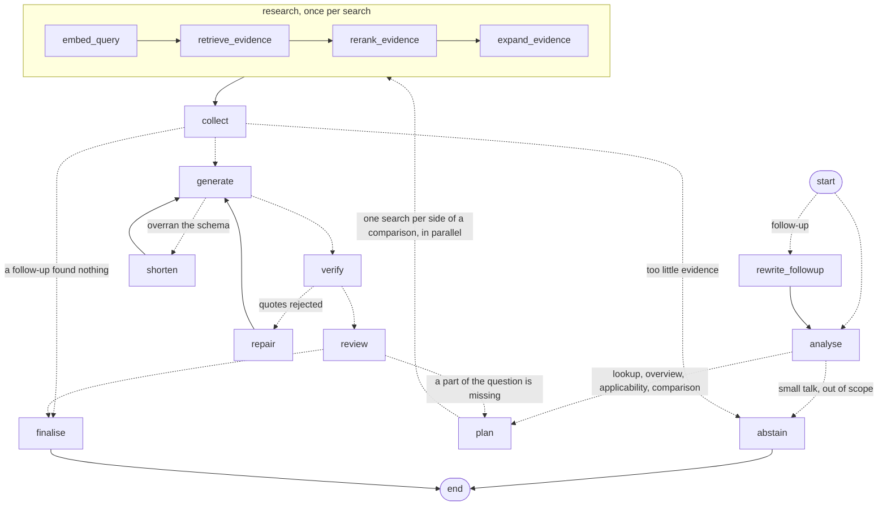

# The answer graph

The answer pipeline is a LangGraph `StateGraph`, built in [`nodes.py`](nodes.py) as `GRAPH`.
Every step is a node that returns only the state fields it changed ([`state.py`](state.py)),
and every decision is an edge (dotted below), so this diagram is the whole control flow.
The prompts the nodes send are in [`prompts.py`](prompts.py).



## One path per kind of question

`analyse` classifies the question and, in the same call, gathers what its path needs.

| Question | Example | What its path does differently |
|---|---|---|
| lookup | "What does Article 50 require?" | The plain path |
| overview | "What are all the requirements for high-risk AI systems?" | `collect` adds an outline of the whole group (Articles 8 to 15), so every part can be named |
| applicability | "Is my CV-screening tool high-risk?" | `plan` adds a second search, in parallel, over only the provisions of the legal test that decides it (Article 6 and Annex III); the answer is a checklist of criteria, never a verdict |
| comparison | "How do chatbot and deepfake duties differ?" | `plan` sends one search per side, run in parallel with `Send`; each side gets its share of the evidence |
| greeting, out of scope | "hello", "what does the GDPR say?" | Stops before anything is searched |

## Review and wrap-up

After the first answer is verified, `review` (the small model) reads it and may ask for
one follow-up round: a missing side of a comparison, or a part the answer depends on. The
follow-up goes through the same search, drafting and verification, so it can only add
verified claims; articles it names are looked up directly, and it may answer only part of
what it asked. Applicability answers are not reviewed: their open points are facts about
the user's own system, which no search can supply. `finalise` then writes one summary over
all the rounds. `max_rounds` in `config.py` sets the limit (2: the question plus one
follow-up).

On Groq's free tier a follow-up round usually waits about a minute: the first answer has
already spent most of that minute's token budget.

The code draws the current graph itself:

```bash
uv run python -c "from euaia.graph.nodes import GRAPH; print(GRAPH.get_graph(xray=True).draw_mermaid())"
```
